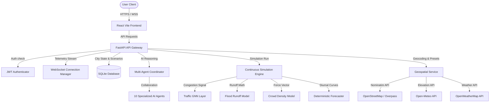
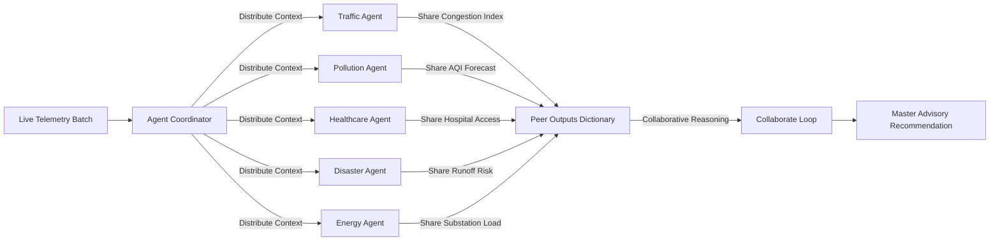
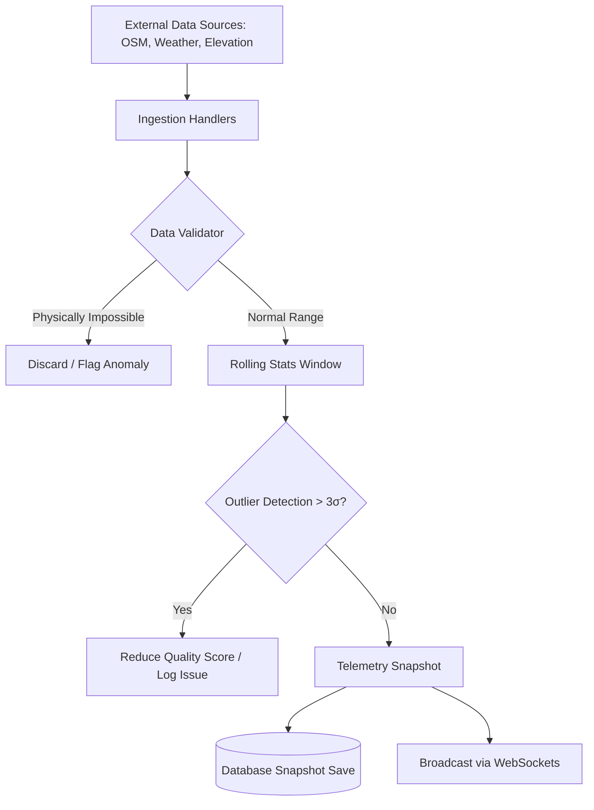
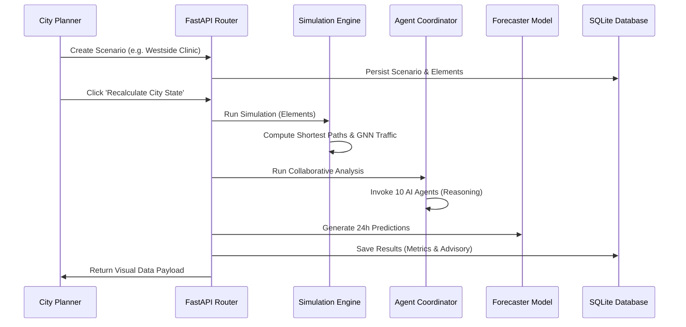
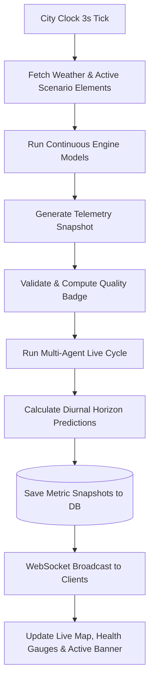
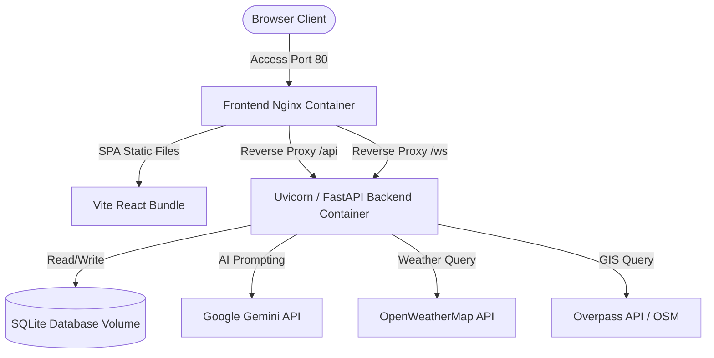

# 🏙️ MIRROR CITY — AI-Powered Smart City Digital Twin

[](https://github.com/yuva-1237/MIRROR-CITY)
[](https://github.com/yuva-1237/MIRROR-CITY/blob/main/LICENSE)
[](#-verification)
[](https://www.python.org/)
[](https://nodejs.org/)
[](https://www.docker.com/)

> **"Simulate, predict, and optimize municipal infrastructure planning decisions before deploying them in the physical world."**

MIRROR CITY is an enterprise-grade Smart City Digital Twin platform. Built with a high-fidelity geospatial engine, a numpy-based Graph Neural Network (GNN) traffic propagator, a 10-agent collaborative AI core, and a real-time WebSocket communication bus, it empowers urban planners, emergency responders, and municipality officials to construct scenarios, simulate impacts, and receive explainable urban advisory reports instantly.

---

## 📋 Table of Contents

1. [Project Overview](#-project-overview)
2. [Key Features](#-key-features)
3. [System Architecture](#-system-architecture)
4. [Folder Structure](#-folder-structure)
5. [Technology Stack](#-technology-stack)
6. [Installation](#-installation)
7. [Configuration](#-configuration)
8. [API Documentation](#-api-documentation)
9. [AI Models & Ingestion](#-ai-models--ingestion)
10. [Simulation Engine](#-simulation-engine)
11. [Digital Twin & GIS](#-digital-twin--gis)
12. [Real-Time WebSocket Features](#-real-time-websocket-features)
13. [Performance Optimizations](#-performance-optimizations)
14. [Security & Compliance](#-security--compliance)
15. [Testing Suite](#-testing-suite)
16. [Deployment & Scaling](#-deployment--scaling)
17. [Project Roadmap](#-project-roadmap)
18. [Contributing](#-contributing)
19. [License & References](#-license--references)

---

## 🔍 Project Overview

### What is MIRROR CITY?
MIRROR CITY is a real-time, hybrid Digital Twin platform. It bridges physical urban data (OpenStreetMap road networks, live weather feeds, elevation layers) with interactive simulation engines. It was created to replace slow, siloed, and static urban planning software with a live, unified command center.

### The Problems It Solves
1. **High Infrastructure Risk**: Physical trials of traffic redirection or hospital placements cost millions. MIRROR CITY lets planners test placements and instantly view metrics.
2. **Siloed Analysis**: Traditional planning separates traffic, pollution, and energy. Our multi-agent system models the cross-domain impacts of planning decisions simultaneously.
3. **Data Quality Noise**: Real sensor networks suffer from telemetry dropouts. Our data validator dynamically checks bounds and anomalies, displaying an offline banner or a data quality badge based on real-time confidence scores.

### Target Audience
* **City Planners & GIS Engineers**: To layout and simulate zoning modifications.
* **Disaster Management Agencies**: To assess runoff risks during heavy rainfall.
* **Government Officials**: To review scenario comparisons and export executive PDFs.
* **Open-Source Contributors**: To plug in custom models for traffic or environment analysis.

---

## ✨ Key Features

### 🧠 Artificial Intelligence
* **Collaborative Multi-Agent Core**: 10 domain-specific AI agents (Traffic, Healthcare, Disaster, etc.) observe telemetry, collaborate via shared memory, and issue recommendations.
* **Gemini Planning Assistant**: A chatbot powered by Google Gemini 1.5 Flash. It ingests active scenario attributes and live metrics to answer open-ended planning questions.

### 🗺️ GIS & Digital Twin
* **Overpass Graph Builder**: Fetches real road networks from OpenStreetMap (OSM) via the Overpass API.
* **Elevation & Weather Ingest**: Resolves elevation queries using the Open-Meteo API and pulls live weather data from the OpenWeatherMap API.

### 🚗 Simulation Engine
* **2-Layer Graph Neural Network**: Propagates congestion across corridors using Graph Convolutional Network layers.
* **Dynamic Commuter Router**: Computes the shortest travel times using Dijkstra's algorithm over dynamically updated GNN edge weights.
* **Disaster & Flood Runoff**: Models precipitation runoff and flood zone propagation based on soil retention and green space assets.

### 📊 Real-Time Monitoring & Dashboards
* **3-Second WS Loop**: Broadcasts telemetry updates, GNN outputs, and active scenario overlays to all connected clients.
* **Detailed Diagnostics**: A health panel monitoring database integrity, agent initialization, and telemetry stream statuses.

---

## 🏛️ System Architecture

### 1. Overall System Architecture
The platform is structured as a decoupled client-server architecture with an asynchronous background loop coordinating the digital twin clock.



### 2. AI Agent Interaction (Collaboration Loop)
Each agent operates on an `Observe -> Reason -> Collaborate -> Recommend` lifecycle, sharing peer observations to produce a final coordinate plan.



### 3. Data Ingestion Pipeline
All external geocoding and sensor readings pass through a strict, multi-stage validation engine before broadcasting or DB persistence.



### 4. Simulation Workflow
Scenario modifications are dynamically routed through the simulation and forecasting layers before results are persisted and sent to the UI.



### 5. Real-Time Event Flow
The `CityClock` class orchestrates the 3-second cycle, feeding active scenario layers to the simulation models and broadcasting outcomes.



### 6. Deployment Architecture
Our multi-container deployment features separation of concern, utilizing an Nginx proxy to handle Vite React static routing and proxying WebSocket/HTTP endpoints to the FastAPI ASGI container.



---

## 📁 Folder Structure

```
MIRROR-CITY/
├── agents/                 # AI Agent definitions and coordinator
│   ├── city_memory.py      # Event memory logs
│   ├── live_agents.py      # Individual agent logical definitions
│   └── agent_coordinator.py# Loop coordinator
├── ai/                     # Shared agent cooperation templates
├── api/                    # FastAPI endpoint routers
│   ├── admin.py            # User controls and audit logs
│   ├── auth.py             # Authentication endpoints
│   ├── geospatial.py       # Geocoding and city loading
│   ├── incidents.py        # Citizen reporting
│   └── simulations.py      # Planning assistant and simulations
├── backend/                # ASGI server configuration
│   └── main.py             # FastAPI entrypoint
├── configs/                # Central config settings
│   ├── config.py           # Settings loader
│   └── security.py         # JWT and password utilities
├── database/               # Database schemas and connection pooling
│   ├── connection.py       # SQLAlchemy engine definition
│   ├── schema.py           # Table models
│   └── seed.py             # Seed scripts
├── frontend/               # React client application (Vite)
│   ├── Dockerfile          # Frontend container definition
│   ├── nginx.conf          # Router and proxy proxy config
│   ├── package.json        # Frontend configuration
│   └── src/                # React source files
├── gis/                    # Physical geography coordinate helpers
│   └── spatial.py          # Haversine distance computations
├── middleware/             # Request preprocessors
│   └── rate_limit.py       # IP-based sliding window rate limiter
├── models/                 # Time-series forecasting models
│   └── forecaster.py       # Diurnal forecast calculators
├── services/               # Shared backend services
│   ├── city_clock.py       # 3-second simulation timer loop
│   ├── data_validator.py   # Anomalies, bounds, and deduplication checks
│   ├── geospatial_service.py # Nominatim cache & OSM graph builders
│   └── weather_service.py  # Weather API fetcher
├── simulation/             # Mathematical simulation layers
│   ├── continuous_engine.py# Graph storage and telemetry metrics
│   ├── crowd_model.py      # Crowd force vectors
│   ├── flood_model.py      # Runoff computations
│   └── gnn.py              # numpy-based spectral GCN propagation
├── tests/                  # Automated pytest files
│   ├── test_api.py         # FastAPI endpoint checks
│   ├── test_geospatial.py  # Cache, rate limiting, and fallback checks
│   └── test_simulation.py  # GNN and spatial distance assertions
├── Dockerfile              # Backend container definition
├── docker-compose.yml      # Multi-container conductor
├── requirements.txt        # Backend dependencies
└── README.md               # Documentation (you are here)
```

---

## 🛠️ Technology Stack

| Category | Technologies |
| :--- | :--- |
| **Frontend** | React, TypeScript, Vite, TailwindCSS, React-Leaflet, Lucide Icons, Recharts |
| **Backend** | Python 3.11+, FastAPI (ASGI), Uvicorn, SQLAlchemy |
| **Artificial Intelligence** | Google Gemini SDK (Gemini 1.5 Flash), Collaborative Multi-Agent System |
| **Simulation / Math** | Graph Neural Networks (NumPy GCN), NetworkX Graph Algorithms, Dijkstra Routing |
| **Geospatial & Maps** | OpenStreetMap Overpass API, Nominatim Geocoding, Open-Meteo Elevation API |
| **Database & Caching** | SQLite (Production default), In-Memory geocode LRU cache, In-Process Telemetry Cache |
| **DevOps & Deploy** | Docker, Docker Compose, Nginx (Reverse Proxy & SPA hosting), GitHub Actions |
| **Testing** | Pytest, FastAPI TestClient, SQLite Mock Engine |

---

## 🚀 Installation

### Prerequisites
* **Python 3.11+**
* **Node.js 18+ & npm**
* **Docker** (optional)

### Method A: Single-Command Docker Compose (Recommended)
This compiles the frontend assets, spawns Nginx, initializes the backend SQLite DB, and starts all systems.
```bash
# Clone the repository
git clone https://github.com/yuva-1237/MIRROR-CITY.git
cd MIRROR-CITY

# Spin up the containers
docker-compose up --build
```
* Dashboard URL: `http://localhost`
* API Endpoint: `http://localhost:8000`

---

### Method B: Local Developer Manual Setup

#### 1. Environment & Keys
Copy the template file to configure settings:
```bash
cp .env.example .env
```
Open `.env` and configure:
* `GEMINI_API_KEY`: Required for Gemini Planning Assistant.
* `OPENWEATHER_API_KEY`: Required for real-time weather query sync.

#### 2. Backend Installation
```bash
# Install dependencies
pip install -r requirements.txt

# Seed SQLite database (creates default users, scenarios, and spatial tables)
python database/seed.py

# Launch server
python backend/main.py
```

#### 3. Frontend Installation
```bash
cd frontend
npm install
npm run dev
```

---

## ⚙️ Configuration

The application is configured using Pydantic Settings in `configs/config.py`. Important environment variables include:

| Variable | Default Value | Purpose |
| :--- | :--- | :--- |
| `NODE_ENV` | `development` | Switches logging formats and debug overlays |
| `LLM_PROVIDER` | `gemini` (if key set, else `mock`) | Toggle between real Gemini API calls and offline mocks |
| `GEMINI_API_KEY` | `""` | Google AI studio API key |
| `OPENWEATHER_API_KEY` | `""` | OpenWeatherMap API key |
| `GEOCODE_CACHE_TTL` | `600` | LRU Cache expiration time for Nominatim results (seconds) |
| `JWT_SECRET` | `super-secret-key...` | Cryptographic signature for authorization tokens |

---

## doc 📖 API Documentation

FastAPI automatically generates interactive Swagger docs at `/docs` (e.g., `http://localhost:8000/docs`).

### Core Endpoints

#### `GET /api/geospatial/search`
Search for locations globally. Incorporates cache checks and Nominatim rate limiting.
* **Authentication**: Required (Bearer JWT)
* **Query Params**: `query=Chennai`
* **Response Example**:
```json
[
  {
    "name": "Chennai",
    "lat": 13.0827,
    "lng": 80.2707,
    "hierarchy": ["India", "Tamil Nadu", "Chennai District", "Chennai"],
    "population": 8900000,
    "area_sq_km": 426.0,
    "elevation": 6.0,
    "location_type": "coastal",
    "timezone": "Asia/Kolkata",
    "source": "Local Baseline Database"
  }
]
```

#### `POST /api/simulations/assistant`
Ask the Gemini Planning Assistant planning questions. Injects city-state metrics into the prompt.
* **Authentication**: Required (Bearer JWT)
* **Request Example**:
```json
{
  "prompt": "Should we construct a hospital near the western suburban sectors?",
  "scenario_id": 2
}
```
* **Response Example**:
```json
{
  "reply": "### Urban Planning Advisory...\nConstructing a hospital near (lat, lng) increases coverage by 15%. Average travel times decrease by 4.2 minutes.",
  "suggested_action": null,
  "confidence_score": 91.0,
  "assumptions": ["Response generated with active scenario context"],
  "limitations": ["Verify against live simulation runoffs"]
}
```

---

## 🧠 AI Models & Ingestion

### Ingestion Validation
Sensors send telemetry to the data validator. Reading values outside standard thresholds are marked as outliers.
$$\text{Outlier Flag} = |x_t - \mu| > 3\sigma$$
If flagged, the sensor's quality score drops by 25%. If a value falls outside absolute physical bounds, the reading is rejected, and its quality score drops by 60%.

### 10-Agent Collaborative AI Core
* **Traffic Agent**: Monitors vehicle counts and edge congestion indices.
* **Healthcare Agent**: Computes accessibility indices based on spatial distances to hospitals.
* **Pollution Agent**: Measures localized carbon density and models particulate AQI dispersion.
* **Weather Agent**: Detects heat islands based on elevation and concrete zoning density.
* **Disaster Agent**: Predicts flood zone vulnerabilities based on runoff accumulation.
* **Economy Agent**: Projects ROI and property premiums from infrastructure additions.
* **Energy Agent**: Simulates grid substation load profiles.
* **Transportation Agent**: Models bus and metro corridor utilization.
* **Urban Growth Agent**: Estimates density growth profiles based on TOD layouts.
* **Infrastructure Agent**: Computes construction stress factors.

---

## 🚗 Simulation Engine

### 1. The GNN Traffic Propagator
Traffic congestion propagates across the network using a numpy-based Graph Convolutional Network (GCN).
$$H^{(l+1)} = \sigma\left(\tilde{D}^{-\frac{1}{2}} \tilde{A} \tilde{D}^{-\frac{1}{2}} H^{(l)} W^{(l)}\right)$$
Where:
* $H^{(l)}$: Node features (population density, type multipliers).
* $\tilde{A}$: Adjacency matrix with self-loops.
* $\tilde{D}$: Degree matrix.
* $W$: Layer weights.

### 2. Router Engine
Using the updated edge congestion values, the simulator dynamically calculates transit travel times:
$$\text{Travel Time} = \frac{\text{Length}}{\text{Speed Limit}} \times (1 + \text{Congestion})^2$$
The routing engine computes shortest paths via Dijkstra's algorithm to simulate commuter travel routes.

---

## 🗺️ Digital Twin & GIS

### Graph Generation Workflow
1. **Zoning Check**: On loading a query, the platform fetches coordinates.
2. **OSM Overpass Query**: Downloads node geometries in a 2km bounding box.
3. **Graph Reconstruction**: Reconstructs intersections as nodes and street corridors as edges, mapping metadata (lanes, speed limits, classification).
4. **Elevation Query**: Calls the Open-Meteo API to fetch the absolute elevation of each intersection, mapping a topographical runoff vector.

---

## 📡 Real-Time WebSocket Features

The backend runs a `CityClock` loop on an asynchronous 3-second cycle. 

```
[CityClock Tick] ──> [Run GNN, Flood, & Crowd Simulations] ──> [Assemble Telemetry]
       │
       ├──> [Run Multi-Agent Collaboration Loop]
       │
       └──> [Broadcast JSON Payload to all Connected Clients via WebSockets]
```

### Telemetry Broadcast Payload Structure
```json
{
  "tick": 42,
  "timestamp": "2026-07-18T12:00:00Z",
  "telemetry": {
    "weather": {"temp": 28.5, "condition": "Sunny", "source": "live_api"},
    "traffic": {"node_0_1": {"congestion_percentage": 15.4}},
    "flood": {"node_0_1": {"water_level_cm": 0.0}}
  },
  "agent_outputs": {
    "traffic": {"findings": "Normal flow", "predictions": {"5m": {"predicted_congestion_percentage": 15.6}}}
  },
  "data_quality": {
    "overall_quality": 98.5,
    "issues": []
  }
}
```

---

## ⚡ Performance Optimizations

* **Geocoding LRU Cache**: Eliminates redundant Nominatim geocoding API calls.
* **Rate-Limit Debouncer**: Imposes a 1-second delay between Nominatim calls to respect API limits.
* **In-Memory Graph Models**: Simulation calculations (GNN & routers) are computed entirely in memory via numpy array mathematics.
* **Background Tasks**: Long-running operations like database updates and verification loops are executed asynchronously in background tasks, keeping the primary request-response cycle fast.

---

## 🔒 Security & Compliance

* **Access Authorization**: Uses JWT tokens with role-based validation.
* **CORS Whitelist**: Whitelists ports `5173` and `3000` for frontend access in development, with support for environment-variable whitelisting in production.
* **IP Throttling**: Limits requests to 60 per minute per IP using an in-memory sliding window rate limiter.
* **Audit Logging**: Saves all user operations (scenario creations, incident updates) into an immutable SQLite `AuditLog` table.

---

## 🧪 Testing Suite

Automated testing is built using pytest. Tests cover API endpoints, JWT token verification, and the geocoding cache.

```bash
# Run the test suite
pytest tests/
```

### Core Tests
* `test_health_endpoint`: Asserts that main health probes return 200 and healthy status.
* `test_geocode_caching`: Asserts that repeated geocode queries return within <1ms via cache hit.
* `test_unknown_location_fallback`: Verifies that invalid searches return clean error responses instead of random fallback coordinates.
* `test_gnn_propagation`: Validates GNN propagation outputs.

---

## 🚢 Deployment & Scaling

### 1. Docker Compose (Single Host)
Spin up the compose file using:
```bash
docker-compose up -d
```

### 2. Kubernetes Scaling
For large-scale deployments, the platform scales the backend and frontend components independently:
* **FastAPI Backend**: Scaled horizontally using a deployment controller with CPU/Memory horizontal autoscalers (HPA).
* **Nginx Frontend**: Scaled as a stateless static container.

---

## 🗺️ Project Roadmap

### Short-Term
* Add support for uploading custom shapefiles (zoning boundaries).
* Support exporting simulation comparisons to CSV and Excel.

### Mid-Term
* Implement a 3D building viewer using Mapbox GL or Deck.gl.
* Integrate Real-Time GTFS feeds for public transit tracking.

### Long-Term
* Implement GPU acceleration (CUDA) for large-scale GNN simulations.
* Support real-time synchronization with physical IoT sensor hubs (SCADA).

---

## 🤝 Contributing

Contributions are welcome! Please follow these steps:
1. Fork the repository.
2. Create a feature branch: `git checkout -b feature/AmazingFeature`
3. Commit your changes: `git commit -m 'Add some AmazingFeature'`
4. Push to the branch: `git push origin feature/AmazingFeature`
5. Open a Pull Request.

Please ensure all tests pass (`pytest tests/`) before submitting your PR.

---

## 📄 License & References

### License
This project is licensed under the MIT License - see the [LICENSE](LICENSE) file for details.

### References
* Kipf, T. N., & Welling, M. (2016). *Semi-Supervised Classification with Graph Convolutional Networks.* arXiv preprint arXiv:1609.02907.
* OpenStreetMap contributors. *Overpass API & Nominatim Geocoding Services.* [openstreetmap.org](https://www.openstreetmap.org/)
* Open-Meteo elevation database. [open-meteo.com](https://open-meteo.com/)
* Google Gemini API Documentation. [ai.google.dev](https://ai.google.dev/)