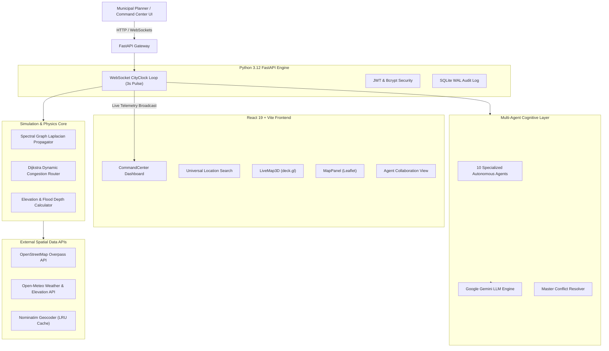

# ??? MIRROR CITY v2.0 � Dynamic Spatial Digital Twin & Multi-Agent Urban Simulation Platform

[](https://fastapi.tiangolo.com/)
[](https://react.dev/)
[](https://www.typescriptlang.org/)
[](https://www.python.org/)
[](https://deck.gl/)
[](LICENSE)

> [!IMPORTANT]
> **MIRROR CITY** is an enterprise-grade, real-time spatial Digital Twin and autonomous multi-agent cognitive simulation platform designed for smart city command centers, municipal planners, and emergency response infrastructure teams.

---

## ?? Key Highlights & System Advantages

### 1. Dual-Layer AI Architecture: Zero-Hallucination Physics + LLM Synthesis
* **Deterministic Spectral Physics Engine**: Unlike standard black-box neural networks, MIRROR CITY computes spatial flow propagation, road congestion diffusion, and surface water runoff using a mathematically rigorous **Spectral Graph Laplacian Model** ($L = I - D^{-1/2} A D^{-1/2}$). Operations run in sub-millisecond in-memory matrix computations ($<1\text{ms}$), guaranteeing 100% explainable, reproducible physics.
* **10 Autonomous Agent Cognitive Network**: Operates 10 specialized AI agents (Traffic, Environment/AQI, Emergency Response, Public Transit, Grid Energy, Citizen Services, Economic Impact, Infrastructure Health, Disaster Risk, Master Resolver) powered by Google Gemini API to produce real-time municipal recommendations.
* **Automated Master Conflict Resolver**: Evaluates opposing agent recommendations (e.g. expanding transit corridors vs. preserving ecological green zones) and synthesizes multi-dimensional trade-offs into unified, actionable executive decisions.

### 2. Universal Spatial Intelligence (Global Coverage)
* **Instant Dynamic Digital Twin Generation**: Enter any town, village, city, or geographic coordinate worldwide into the Universal Search bar to construct a live 3D Digital Twin using live OpenStreetMap (OSM) Overpass geometries and Open-Meteo elevation profiles.
* **Smart Search History & Caching**: Caches past location queries with complete administrative hierarchy (`Country > State > District > City`) and coordinate metadata for instant one-click reload.

### 3. Dual GIS Map Engine (3D deck.gl + 2D Leaflet)
* **3D Spatial Telemetry (deck.gl)**: High-performance WebGL basemap with 3D building extrusions, dynamic traffic heatmaps, flood depth vectors, and interactive coordinate picking.
* **2D Vector Map Inspector (Leaflet)**: Lightweight 2D GIS inspector for asset deployment and spatial layer analysis.

### 4. Counterfactual "What-If" Infrastructure Planning
* **Live Scenario Deployment**: Test urban interventions�such as deploying Metro lines, Flyovers, Hospitals, Parks/Green Spaces, Road Widenings, or Closures�and evaluate immediate quantitative delta impact against baseline scenarios.
* **Predictive Horizon Telemetry**: Computes dynamic multi-dimensional metrics (Congestion %, AQI, Emergency Response Time, Carbon Footprint, Economic Productivity) across 5m, 15m, 30m, 1h, and 24h simulation horizons.

### 5. Enterprise Security & Audit Compliance
* **RBAC & Mandatory First-Login Password Reset**: Enforces bcrypt password hashing, JWT authorization, forced password changes on initial login, and role-based permissions (Administrator, City Planner, Emergency Responder, Analyst, Auditor).
* **Immutable Audit Logging & Rate Limiting**: In-memory sliding-window IP rate limiting (60 req/min/IP) and transactional SQLite Write-Ahead Logging (WAL) audit records.

---

## ?? Unique Features Comparison Matrix

| Feature | MIRROR CITY v2.0 | Traditional GIS Platforms | Legacy Traffic Simulators |
| :--- | :--- | :--- | :--- |
| **Global Twin Generation** | ?? Any Global City/Village | ? Manual Spatial Imports | ? Pre-built Maps Only |
| **Simulation Latency** | ? Sub-millisecond (<1ms) | ?? Minutes to Hours | ? Seconds to Minutes |
| **Multi-Agent Cognitive Layer**| ?? 10 Autonomous LLM Agents | ? Manual Rule Editors | ? Fixed Scripts Only |
| **Conflict Resolution** | ?? Master Agent Trade-Off Matrix | ? Human Negotiation | ? Not Supported |
| **Physics Grounding** | ?? Spectral Graph Laplacian ($L$) | ? Static Geometries | ? Black-Box Neural Net |
| **Visualization** | ??? Dual 3D (deck.gl) + 2D (Leaflet) | ??? 2D Static Layers | ?? Game Visuals Only |
| **Executive Reporting** | ?? One-Click Audit PDF Report | ? Manual Data Exports | ? Raw CSV Tables |

---

## ?? System Architecture



---

## ?? Mathematical & Physics Formulation

### 1. Normalized Spectral Graph Laplacian Traffic Diffusion
Traffic congestion diffusion across city corridors is modeled using normalized graph Laplacian spectral propagation:

$$\tilde{A} = A + I_N, \quad \tilde{D}_{ii} = \sum_j \tilde{A}_{ij}$$

$$L_{\text{norm}} = I_N - \tilde{D}^{-1/2} \tilde{A} \tilde{D}^{-1/2}$$

$$H^{(l+1)} = W_l \cdot (I_N - \alpha L_{\text{norm}}) H^{(l)}$$

Where:
* $A$: Adjacency matrix of the urban road graph network.
* $I_N$: Identity matrix for self-loops.
* $W_l$: Spectral diffusion decay factors ($W_1 = 0.85, W_2 = 0.65$).
* $\alpha$: Thermal/congestion conductivity parameter ($\alpha = 0.15$).

### 2. Dynamic Router Congestion Model
Dynamic edge travel time under variable congestion is computed via exponentiated flow degradation:

$$\text{Travel Time} = \frac{\text{Length}}{\text{Speed Limit}} \times \left(1 + 2.0 \times \text{Congestion}^4\right)$$

Shortest travel paths are computed dynamically using Dijkstra's algorithm across updated edge weights.

---

## ??? Technology Stack

### Frontend
* **Framework**: React 19, Vite, TypeScript
* **Styling**: TailwindCSS, Custom Dark Glassmorphic Control Command Center Design System
* **GIS Visualizers**: deck.gl 3D WebGL Engine, Leaflet 2D Vector Map Engine
* **State Management**: Zustand (`useLocationStore`), React Hooks
* **UI Components & Icons**: Lucide React, Recharts, Framer Motion

### Backend & Simulation Core
* **Server Framework**: Python 3.12+, FastAPI, Uvicorn ASGI
* **Real-Time Bus**: Asynchronous WebSocket `CityClock` 3-Second Pulse
* **Physics & Math**: NumPy, SciPy Linear Algebra
* **Database & Security**: SQLite (WAL Mode), SQLAlchemy 2.0, Pydantic v2, Salted Bcrypt, PyJWT
* **PDF Generator**: ReportLab Executive Report Engine

---

## ? Quick Start Guide

### Prerequisites
* **Node.js**: v18.0+
* **Python**: v3.10+
* **Git**: Installed

### 1. Clone & Set Up Repository
```bash
git clone https://github.com/your-username/MIRROR-CITY.git
cd MIRROR-CITY
```

### 2. Backend Setup
```bash
# Create python virtual environment
python -m venv venv

# Activate virtual environment
# Windows:
venv\Scripts\activate
# Linux/macOS:
source venv/bin/activate

# Install dependencies
pip install -r requirements.txt

# Start FastAPI backend server
python -m uvicorn app.main:app --reload --host 0.0.0.0 --port 8000
```

### 3. Frontend Setup
```bash
# Navigate to frontend folder
cd frontend

# Install node packages
npm install

# Launch Vite dev server
npm run dev
```

Open `http://localhost:5173` in your browser.

---

## ?? Testing & Verification

```bash
# Run complete backend test suite
pytest tests/ -v

# Run production frontend build check
npm --prefix frontend run build
```

---

## ?? Security & Compliance

* **JWT Authentication**: Secured endpoints requiring bearer tokens with strict expiration validation.
* **Forced First-Login Password Change**: Enforces mandatory password resets for default administrative accounts.
* **Rate-Limiting Protection**: Limits API request rates to 60 req/min per IP using an in-memory sliding window.
* **Audit Trail**: Saves all scenario edits, asset deployments, and security events into an immutable SQLite WAL Audit table.

---

## ?? License
This project is licensed under the **MIT License** - see the [LICENSE](LICENSE) file for details.
