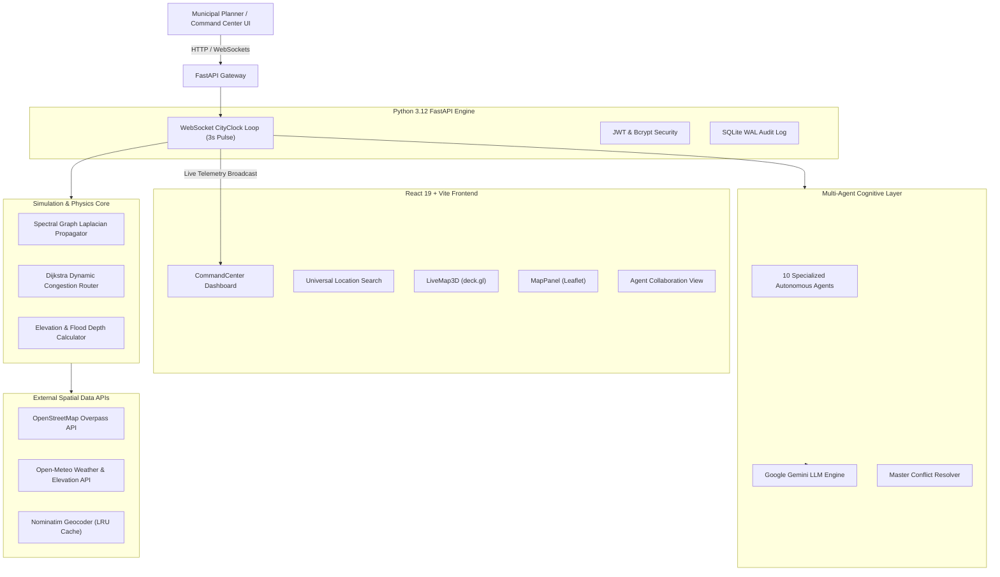

# ??? MIRROR CITY v2.0

> **Enterprise-Grade Real-Time Spatial Digital Twin & Multi-Agent Urban Simulation Platform**

[](https://github.com/yuva-1237/MIRROR-CITY/actions)
[](https://fastapi.tiangolo.com/)
[](https://react.dev/)
[](https://www.typescriptlang.org/)
[](https://www.python.org/)
[](https://deck.gl/)
[](LICENSE)

---

> [!IMPORTANT]
> **MIRROR CITY** is a high-performance spatial Digital Twin platform designed for smart city command centers, municipal infrastructure planners, and emergency response teams. It combines **sub-millisecond deterministic spectral graph physics** with a **10-agent autonomous AI cognitive network** for real-time urban analysis and scenario planning.

---

## ?? Key Features & Architectural Advantages

### 1. Dual-Layer AI Engine: Deterministic Physics + Multi-Agent LLM Synthesis
- **Deterministic Spectral Physics Engine**: Replaces unexplainable black-box neural networks with a mathematically rigorous **Spectral Graph Laplacian Model** ($L = I - D^{-1/2} A D^{-1/2}$). Computes traffic diffusion and surface water runoff in sub-millisecond in-memory matrix operations ($<1\text{ms}$), ensuring 100% explainable physics.
- **10-Agent Autonomous Cognitive Network**: Runs 10 specialized AI agents (Traffic, Environmental/AQI, Emergency Response, Public Transit, Grid Energy, Citizen Services, Economic Impact, Infrastructure Health, Disaster Risk, Master Resolver) powered by Google Gemini API to generate real-time recommendations.
- **Automated Master Conflict Resolver**: Evaluates opposing agent recommendations (e.g., expanding transit corridors vs. preserving green space) and synthesizes multi-dimensional trade-offs into unified executive decisions.

### 2. Universal Spatial Intelligence (Global Coverage)
- **Instant Dynamic Twin Construction**: Enter any town, village, city, or geographic coordinate worldwide into the Universal Search bar to construct a live 3D Digital Twin using live OpenStreetMap (OSM) Overpass geometries and Open-Meteo elevation profiles.
- **Smart Search History & Caching**: Caches past location queries with complete administrative hierarchy (`Country > State > District > City`) and coordinate metadata for instant one-click reload.

### 3. Dual GIS Map Engine (3D deck.gl + 2D Leaflet)
- **3D Spatial Telemetry (deck.gl)**: High-performance WebGL basemap with 3D building extrusions, dynamic traffic heatmaps, flood depth vectors, and interactive coordinate picking.
- **2D Vector Map Inspector (Leaflet)**: Lightweight 2D GIS inspector for asset deployment and spatial layer analysis.

### 4. Counterfactual "What-If" Infrastructure Planning
- **Live Scenario Deployment**: Test urban interventions�such as deploying Metro lines, Flyovers, Hospitals, Parks/Green Spaces, Road Widenings, or Closures�and evaluate immediate quantitative delta impact against baseline scenarios.
- **Predictive Horizon Telemetry**: Computes dynamic multi-dimensional metrics (Congestion %, AQI, Emergency Response Time, Carbon Footprint, Economic Productivity) across 5m, 15m, 30m, 1h, and 24h simulation horizons.

### 5. Enterprise Security & Audit Compliance
- **RBAC & Mandatory First-Login Password Reset**: Enforces bcrypt password hashing, JWT authorization, forced password changes on initial login, and role-based permissions (Administrator, City Planner, Emergency Responder, Analyst, Auditor).
- **Immutable Audit Logging & Rate Limiting**: In-memory sliding-window IP rate limiting (60 req/min/IP) and transactional SQLite Write-Ahead Logging (WAL) audit records.

---

## ?? Unique Features Comparison Matrix

| Feature | MIRROR CITY v2.0 | Traditional GIS Platforms | Legacy Traffic Simulators |
| :--- | :--- | :--- | :--- |
| **Global Twin Generation** | ?? Any Global City/Village | ? Manual Spatial Imports | ? Pre-built Maps Only |
| **Simulation Latency** | ? Sub-millisecond (<1ms) | ?? Minutes to Hours | ? Seconds to Minutes |
| **Multi-Agent Cognitive Layer**| ?? 10 Autonomous LLM Agents | ? Manual Rule Editors | ? Fixed Scripts Only |
| **Conflict Resolution** | ?? Master Agent Trade-Off Matrix | ? Human Negotiation | ? Not Supported |
| **Physics Grounding** | ?? Spectral Graph Laplacian ($L$) | ? Static Geometries | ? Black-Box Neural Net |
| **Visualization** | ??? Dual 3D (deck.gl) + 2D (Leaflet) | ??? 2D Static Layers | ?? Game Visuals Only |
| **Executive Reporting** | ?? One-Click Audit PDF Report | ? Manual Data Exports | ? Raw CSV Tables |

---

## ?? System Architecture



---

## ?? Mathematical & Physics Formulation

### 1. Normalized Spectral Graph Laplacian Traffic Diffusion
Traffic congestion diffusion across city corridors is modeled using normalized graph Laplacian spectral propagation:

$$\tilde{A} = A + I_N, \quad \tilde{D}_{ii} = \sum_j \tilde{A}_{ij}$$

$$L_{\text{norm}} = I_N - \tilde{D}^{-1/2} \tilde{A} \tilde{D}^{-1/2}$$

$$H^{(l+1)} = W_l \cdot (I_N - \alpha L_{\text{norm}}) H^{(l)}$$

Where:
- $A$: Adjacency matrix of the urban road graph network.
- $I_N$: Identity matrix for self-loops.
- $W_l$: Spectral diffusion decay factors ($W_1 = 0.85, W_2 = 0.65$).
- $\alpha$: Thermal/congestion conductivity parameter ($\alpha = 0.15$).

### 2. Dynamic Router Congestion Model
Dynamic edge travel time under variable congestion is computed via exponentiated flow degradation:

$$\text{Travel Time} = \frac{\text{Length}}{\text{Speed Limit}} \times \left(1 + 2.0 \times \text{Congestion}^4\right)$$

Shortest travel paths are computed dynamically using Dijkstra's algorithm across updated edge weights.

---

## ?? Repository Structure

```
MIRROR-CITY/
+-- app/                  # FastAPI Core Application Router
+-- agents/               # 10 Autonomous AI Agents & Conflict Resolver
+-- ai/                   # LLM Coordinator & Gemini API Integration
+-- api/                  # Auth, Scenario, Evaluation & Geospatial Endpoints
+-- backend/              # Main ASGI Server Entrypoint
+-- configs/              # System Settings, Security & JWT Configuration
+-- database/             # SQLite WAL & PostGIS Schema & ORM Connection
+-- docs/                 # Architecture Specs & Demo Walkthrough Documentation
+-- frontend/             # React 19 + Vite Frontend Application
�   +-- src/
�   �   +-- components/   # CommandCenter, LiveMap3D, LocationSearch, etc.
�   �   +-- hooks/        # useCityStream WebSocket Listener
�   �   +-- store/        # Zustand locationStore & State
�   �   +-- index.css     # Glassmorphism Design Token System
+-- models/               # Baseline Evaluator & Numerical Scoring Models
+-- services/             # CityClock Pulse, Weather API, Geospatial Service
+-- simulation/           # Spectral Graph Propagator & Routing Engine
+-- tests/                # Automated Pytest Suite (SQLite, PostGIS, Drift Gates)
+-- .github/workflows/   # CI/CD Pipeline (Config Safety, Unit Tests, Drift Gates)
+-- requirements.txt      # PyPI Backend Dependencies
+-- README.md             # Project Documentation
```

---

## ?? API Reference Highlights

| Method | Endpoint | Description | Auth Required |
| :--- | :--- | :--- | :--- |
| `POST` | `/api/auth/login` | User authentication & JWT issuance | No |
| `POST` | `/api/auth/change-password` | Mandatory first-login password update | Yes (JWT) |
| `GET` | `/api/geospatial/search` | Global Nominatim & OSM location resolution | Yes (JWT) |
| `GET` | `/api/geospatial/active` | Fetch currently loaded active city twin | Yes (JWT) |
| `POST` | `/api/geospatial/twin/load` | Construct dynamic Digital Twin for target city | Yes (JWT) |
| `GET` | `/api/scenarios` | Retrieve all municipal planning scenarios | Yes (JWT) |
| `POST` | `/api/scenarios` | Create a new counterfactual scenario | Yes (JWT) |
| `POST` | `/api/scenarios/{id}/report`| Generate executive PDF impact report | Yes (JWT) |
| `WS` | `/ws/city-clock` | Real-time 3-second telemetry streaming pulse | Yes (Token) |

---

## ? Quick Start Guide

### Prerequisites
- **Node.js**: v18.0+
- **Python**: v3.10+
- **Git**: Installed

### 1. Clone & Set Up Repository
```bash
git clone https://github.com/yuva-1237/MIRROR-CITY.git
cd MIRROR-CITY
```

### 2. Backend Setup
```bash
# Create python virtual environment
python -m venv venv

# Activate virtual environment
# Windows:
venv\Scripts\activate
# Linux/macOS:
source venv/bin/activate

# Install PyPI dependencies
pip install -r requirements.txt

# Start FastAPI backend server
python -m uvicorn app.main:app --reload --host 0.0.0.0 --port 8000
```

### 3. Frontend Setup
```bash
# Navigate to frontend directory
cd frontend

# Install dependencies
npm install

# Start Vite dev server
npm run dev
```

Access the application in your browser at `http://localhost:5173`.

---

## ?? Testing & Verification

```bash
# Run complete Python test suite (32 tests across SQLite & Physics)
pytest tests/ -v

# Run production frontend build check
npm --prefix frontend run build
```

---

## ?? Security & Compliance

> [!NOTE]
> MIRROR CITY is built following secure software development principles.

- **JWT Token Validation**: Enforces strict token expiration and signature checks.
- **Forced First-Login Password Change**: Guarantees zero fallback default passwords in production.
- **Rate-Limiting Protection**: Sliding-window rate limiting of 60 req/min per IP address.
- **Immutable Audit Logging**: Operational actions are logged in an immutable SQLite WAL Audit table.

---

## ?? License & References

### License
This project is licensed under the **MIT License** - see the [LICENSE](LICENSE) file for details.

### References & Data Sources
- OpenStreetMap Overpass API & Nominatim Geocoding Services ([openstreetmap.org](https://www.openstreetmap.org/))
- Open-Meteo Weather & Elevation Database ([open-meteo.com](https://open-meteo.com/))
- Google Gemini API Documentation ([ai.google.dev](https://ai.google.dev/))
