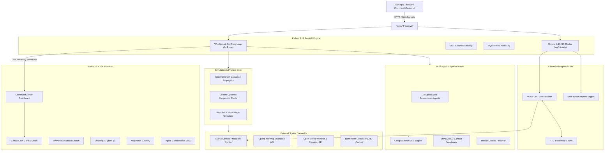

# 🏙️ MIRROR CITY v2.0

> **Enterprise-Grade Real-Time Spatial Digital Twin & Multi-Agent Urban Simulation Platform**

[](https://github.com/yuva-1237/MIRROR-CITY/actions)
[](https://fastapi.tiangolo.com/)
[](https://react.dev/)
[](https://www.typescriptlang.org/)
[](https://www.python.org/)
[](https://deck.gl/)
[](LICENSE)

---

> [!IMPORTANT]
> **MIRROR CITY** is a high-performance spatial Digital Twin platform designed for smart city command centers, municipal infrastructure planners, and emergency response teams. It combines **sub-millisecond deterministic spectral graph physics**, a **10-agent autonomous AI cognitive network**, and an authoritative **ENSO / Climate DNA Intelligence subsystem** for real-time planetary teleconnection and urban risk analysis.

---

## ✨ Key Features & Architectural Advantages

### 1. Dual-Layer AI Engine: Deterministic Physics + Multi-Agent LLM Synthesis
- **Deterministic Spectral Physics Engine**: Replaces unexplainable black-box neural networks with a mathematically rigorous **Spectral Graph Laplacian Model** ($L = I - D^{-1/2} A D^{-1/2}$). Computes traffic diffusion and surface water runoff in sub-millisecond in-memory matrix operations ($<1\text{ms}$), ensuring 100% explainable physics.
- **10-Agent Autonomous Cognitive Network**: Runs 10 specialized AI agents (Traffic, Environmental/AQI, Emergency Response, Public Transit, Grid Energy, Citizen Services, Economic Impact, Infrastructure Health, Disaster Risk, Master Resolver) powered by Google Gemini API to generate real-time recommendations.
- **Automated Master Conflict Resolver**: Evaluates opposing agent recommendations (e.g., expanding transit corridors vs. preserving green space) and synthesizes multi-dimensional trade-offs into unified executive decisions.

### 2. Climate Intelligence & ENSO / Climate DNA
- **Authoritative Climate Grounding**: Ingests real-time Oceanic Niño Index (ONI) observations directly from the **NOAA Climate Prediction Center (CPC)** with in-memory TTL caching and strict circuit-breaker protection.
- **Multi-Sector Risk Impact Engine**: Translates planetary-scale El Niño / La Niña / Neutral phase teleconnections into 7 localized municipal risk vectors: **Rainfall, Flood, Drought, Heat, Water Stress, Agriculture, and Infrastructure**.
- **Counterfactual Scenario Simulation**: Enables municipal planners to simulate what-if climate regime shifts (e.g., *Current La Niña → Extreme El Niño*) with mandatory scientific disclaimers (**"SIMULATED SCENARIO — NOT A FORECAST"**).
- **SHADOW AI Attribution**: Grounded context injection allowing AI queries to explain complex multi-signal urban risks without hallucinating deterministic weather predictions.

### 3. Universal Spatial Intelligence (Global Coverage)
- **Instant Dynamic Twin Construction**: Enter any town, village, city, or geographic coordinate worldwide into the Universal Search bar to construct a live 3D Digital Twin using live OpenStreetMap (OSM) Overpass geometries and Open-Meteo elevation profiles.
- **Smart Search History & Caching**: Caches past location queries with complete administrative hierarchy (`Country > State > District > City`) and coordinate metadata for instant one-click reload.

### 4. Dual GIS Map Engine (3D deck.gl + 2D Leaflet)
- **3D Spatial Telemetry (deck.gl)**: High-performance WebGL basemap with 3D building extrusions, dynamic traffic heatmaps, flood depth vectors, and interactive coordinate picking.
- **2D Vector Map Inspector (Leaflet)**: Lightweight 2D GIS inspector for asset deployment and spatial layer analysis.

### 5. Counterfactual "What-If" Infrastructure Planning
- **Live Scenario Deployment**: Test urban interventions—such as deploying Metro lines, Flyovers, Hospitals, Parks/Green Spaces, Road Widenings, or Closures—and evaluate immediate quantitative delta impact against baseline scenarios.
- **Predictive Horizon Telemetry**: Computes dynamic multi-dimensional metrics (Congestion %, AQI, Emergency Response Time, Carbon Footprint, Economic Productivity) across 5m, 15m, 30m, 1h, and 24h simulation horizons.

### 6. Enterprise Security & Audit Compliance
- **RBAC & Mandatory First-Login Password Reset**: Enforces bcrypt password hashing, JWT authorization, forced password changes on initial login, and role-based permissions (Administrator, City Planner, Emergency Responder, Analyst, Auditor).
- **Immutable Audit Logging & Rate Limiting**: In-memory sliding-window IP rate limiting (60 req/min/IP) and transactional SQLite Write-Ahead Logging (WAL) audit records.

---

## 📊 Unique Features Comparison Matrix

| Feature | MIRROR CITY v2.0 | Traditional GIS Platforms | Legacy Traffic Simulators |
| :--- | :--- | :--- | :--- |
| **Global Twin Generation** | 🌐 Any Global City/Village | ❌ Manual Spatial Imports | ❌ Pre-built Maps Only |
| **Simulation Latency** | ⚡ Sub-millisecond (<1ms) | ⏳ Minutes to Hours | ⚠️ Seconds to Minutes |
| **Multi-Agent Cognitive Layer**| 🤖 10 Autonomous LLM Agents | ❌ Manual Rule Editors | ⚠️ Fixed Scripts Only |
| **Conflict Resolution** | ⚖️ Master Agent Trade-Off Matrix | 👥 Human Negotiation | ❌ Not Supported |
| **Physics Grounding** | 📐 Spectral Graph Laplacian ($L$) | ❌ Static Geometries | ⚠️ Black-Box Neural Net |
| **Climate Intelligence** | 🌊 Planetary ENSO + Teleconnections | ❌ Local Forecast Only | ❌ Not Supported |
| **Visualization** | 🗺️ Dual 3D (deck.gl) + 2D (Leaflet) | 📄 2D Static Layers | 🎮 Game Visuals Only |
| **Executive Reporting** | 📑 One-Click Audit PDF Report | ❌ Manual Data Exports | 📄 Raw CSV Tables |

---

## 🏛️ System Architecture



---

## 📐 Mathematical & Physics Formulation

### 1. Normalized Spectral Graph Laplacian Traffic Diffusion
Traffic congestion diffusion across city corridors is modeled using normalized graph Laplacian spectral propagation:

$$\tilde{A} = A + I_N, \quad \tilde{D}_{ii} = \sum_j \tilde{A}_{ij}$$

$$L_{\text{norm}} = I_N - \tilde{D}^{-1/2} \tilde{A} \tilde{D}^{-1/2}$$

$$H^{(l+1)} = W_l \cdot (I_N - \alpha L_{\text{norm}}) H^{(l)}$$

Where:
- $A$: Adjacency matrix of the urban road graph network.
- $I_N$: Identity matrix for self-loops.
- $W_l$: Spectral diffusion decay factors ($W_1 = 0.85, W_2 = 0.65$).
- $\alpha$: Thermal/congestion conductivity parameter ($\alpha = 0.15$).

### 2. Dynamic Router Congestion Model
Dynamic edge travel time under variable congestion is computed via exponentiated flow degradation:

$$\text{Travel Time} = \frac{\text{Length}}{\text{Speed Limit}} \times \left(1 + 2.0 \times \text{Congestion}^4\right)$$

Shortest travel paths are computed dynamically using Dijkstra's algorithm across updated edge weights.

---

## 📂 Repository Structure

```
MIRROR-CITY/
├── app/                  # FastAPI Core Application Router
├── agents/               # 10 Autonomous AI Agents & Conflict Resolver
├── ai/                   # LLM Coordinator & Gemini API Integration
├── api/                  # Auth, Scenario, Geospatial & Climate Endpoints
│   ├── climate.py        # /api/climate (ENSO, Impact, DNA, Timeline, Simulation)
│   ├── simulations.py    # SHADOW AI Query Handler & Scenario Sandbox
│   └── geospatial.py     # Nominatim Geocoder & Dynamic Twin Loader
├── backend/              # Main ASGI Server Entrypoint
├── configs/              # System Settings, Security & JWT Configuration
├── database/             # SQLite WAL & PostGIS Schema & ORM Connection
├── docs/                 # Architecture Specs, CLIMATE_DNA.md, ENSO_IMPLEMENTATION.md
├── fixtures/             # Historical ONI baseline records (1950–2026)
├── frontend/             # React 19 + Vite Frontend Application
│   ├── src/
│   │   ├── api/          # climateApi.ts (Typed client for ENSO & Impacts)
│   │   ├── components/   # CommandCenter, LiveMap3D, LocationSearch, Dashboard
│   │   │   └── ClimateDNA/  # ClimateDNA, ClimateDNACard, ClimateDNAModal, ClimateTimeline, ClimateScenarioPanel
│   │   ├── hooks/        # useCityStream WebSocket Listener
│   │   ├── store/        # Zustand locationStore & State
│   │   └── index.css     # Glassmorphism Design Token System
│   └── tests/            # Frontend Node.js Component & Accessibility Test Suite
├── services/             # Core Backend Services
│   ├── city_clock.py     # 3s Pulse Streaming Engine & Telemetry Broadcast
│   ├── climate/          # ENSO Provider, Service, Cache, Types & Impact Service
│   │   ├── enso_provider.py         # Authoritative NOAA CPC ONI Parser
│   │   ├── enso_service.py          # State Determination & Confidence Scorer
│   │   ├── enso_cache.py            # Thread-Safe In-Memory TTL Cache
│   │   ├── enso_types.py            # EnsoPhase, EnsoIntensity, Normalized Schemas
│   │   └── climate_impact_service.py # 7-Sector Municipal Teleconnection Engine
│   └── geospatial_service.py        # Overpass OSM Geometry Loader
├── tests/                # Backend Pytest Suite (test_climate.py, drift gates, db tests)
├── .env.example          # Environment Variable Configuration Template
├── requirements.txt      # PyPI Backend Dependencies
└── README.md             # Platform Documentation
```

---

## 🔌 API Reference Highlights

| Method | Endpoint | Description | Auth Required |
| :--- | :--- | :--- | :--- |
| `POST` | `/api/auth/login` | User authentication & JWT issuance | No |
| `POST` | `/api/auth/change-password` | Mandatory first-login password update | Yes (JWT) |
| `GET` | `/api/climate/enso` | Authoritative NOAA ENSO state & intensity | No |
| `GET` | `/api/climate/impact` | City multi-sector climate risk matrix & drivers | No |
| `GET` | `/api/climate/dna` | CITY DNA climate signal hierarchy | No |
| `GET` | `/api/climate/timeline` | Historical ONI cycle records (1950–2026) | No |
| `POST` | `/api/climate/simulate` | What-if scenario sensitivity evaluation | No |
| `GET` | `/api/geospatial/search` | Global Nominatim & OSM location resolution | Yes (JWT) |
| `GET` | `/api/geospatial/active` | Fetch currently loaded active city twin | Yes (JWT) |
| `POST` | `/api/geospatial/twin/load` | Construct dynamic Digital Twin for target city | Yes (JWT) |
| `GET` | `/api/scenarios` | Retrieve all municipal planning scenarios | Yes (JWT) |
| `POST` | `/api/scenarios` | Create a new counterfactual scenario | Yes (JWT) |
| `POST` | `/api/scenarios/{id}/report`| Generate executive PDF impact report | Yes (JWT) |
| `WS` | `/ws/city-clock` | Real-time 3-second telemetry streaming pulse | Yes (Token) |

---

## 🌍 Climate Intelligence & ENSO / Climate DNA

MIRROR CITY incorporates an authoritative **Climate Intelligence & ENSO Engine** connecting planetary-scale climate oscillations directly into municipal risk modeling.

### What is ENSO?
The **El Niño–Southern Oscillation (ENSO)** is a coupled ocean-atmosphere phenomenon in the tropical Pacific Ocean. It shifts sea surface temperatures and atmospheric convection between warm (**El Niño**), cool (**La Niña**), and **Neutral** phases, modulating global jet streams, monsoon intensity, and precipitation patterns across continents.

### Authoritative Data Grounding
- **Data Source**: Real-time Oceanic Niño Index (ONI) and diagnostic synopsis from the **NOAA Climate Prediction Center (CPC)** (`https://www.cpc.ncep.noaa.gov/data/indices/oni.ascii.txt`).
- **Data Model**: Normalized schema representing phase (`EL_NINO`, `LA_NINA`, `NEUTRAL`, `UNKNOWN`), intensity (`WEAK`, `MODERATE`, `STRONG`, `UNKNOWN`), confidence score, observation period, and source URL. Unavailable fields are strictly represented as `null`—never fabricated.
- **Caching & Observability**: High-performance in-memory caching with configurable TTL (`ENSO_CACHE_TTL=21600` / 6 hours) prevents redundant external calls. Structured logs track provider requests, cache hits/misses, and circuit-breaker activations.

### How MIRROR CITY Uses It
1. **CITY DNA Hierarchy**: Injects ENSO phase, rainfall anomaly, temperature anomaly, and seasonal signals into the structured CITY DNA tree.
2. **Multi-Agent Cognitive Layer**: Feeds global climate signals into `WeatherAI`, `FloodAI`, and the master conflict resolver on every simulation tick.
3. **SHADOW AI Attribution**: Grounded context source for AI inquiries (e.g., *"Why is rainfall risk elevated?"*), articulating how large-scale teleconnections couple with seasonal rainfall and local topography.
4. **Dashboard Widget & Mission Control**: `ClimateDNACard` and `ClimateDNAModal` provide real-time status badges, 7-sector impact matrices, interactive Pacific teleconnection wave vectors, and historical time series from 1950 to 2026.

### Climate Impact Model
The multi-sector impact engine (`calculate_climate_impact`) combines:
- Active ENSO phase and intensity
- Geographic coordinates, elevation, and terrain
- Seasonal monsoon calendars (e.g., Southwest Monsoon vs. Peninsular Northeast Retreating Monsoon)
- Regional teleconnection coupling factors

It outputs structured risk indicators across 7 core sectors: **Rainfall, Flood, Drought, Heat, Water Stress, Agriculture, and Infrastructure**, each with explicit non-color text indicators (`LOW`, `MODERATE`, `ELEVATED`, `HIGH`), confidence scores, and causal driver breakdowns.

### Scientific Methodology & Limitations
- **Probabilistic Boundary Condition**: ENSO shifts the background statistical probability distribution of regional weather events; it does **not** deterministically predict whether it will rain on a specific day or time.
- **Complementary to Local Sensors**: Local Doppler radars, stormwater sensors, and elevation drainage remain authoritative for operational real-time emergency dispatch.

### Scenario Analysis vs. Forecasting Distinction
The **"What-If" Climate Scenario Panel** allows urban planners to simulate alternative global phases (e.g., *Current La Niña → Counterfactual El Niño*) to evaluate municipal infrastructure resilience. All simulated outputs are prominently labeled:
> ⚠️ **SIMULATED SCENARIO — NOT A FORECAST**  
> Counterfactual sensitivity modeling tests municipal resiliency against alternative global climate regimes and must not be presented as a weather prediction.

For comprehensive technical documentation, refer to [docs/CLIMATE_DNA.md](docs/CLIMATE_DNA.md) and [docs/ENSO_IMPLEMENTATION.md](docs/ENSO_IMPLEMENTATION.md).

---

## 🚀 Quick Start Guide

### Prerequisites
- **Node.js**: v18.0+
- **Python**: v3.12+ (or v3.10+)
- **Git**: Installed

### 1. Clone & Set Up Environment
```bash
git clone https://github.com/yuva-1237/MIRROR-CITY.git
cd MIRROR-CITY

# Copy environment variable template
cp .env.example .env
```

### 2. Backend Setup
```bash
# Create python virtual environment
python -m venv venv

# Activate virtual environment
# Windows:
venv\Scripts\activate
# Linux/macOS:
source venv/bin/activate

# Install PyPI dependencies
pip install -r requirements.txt

# Start FastAPI backend server
python -m uvicorn backend.main:app --reload --host 0.0.0.0 --port 8000
```

### 3. Frontend Setup
```bash
# Navigate to frontend directory
cd frontend

# Install dependencies
npm install

# Start Vite dev server
npm run dev
```

Access the application in your browser at `http://localhost:5173`.

---

## 🧪 Testing & Verification

```bash
# Run backend pytest suite (14 Climate Intelligence tests + physics & database tests)
npm run test:backend
# or: pytest tests/test_climate.py -v

# Run frontend test suite (11 Climate DNA, accessibility & component tests)
npm run test:frontend
# or: npm --prefix frontend test

# Run production frontend build check
npm run build
# or: npm --prefix frontend run build
```

---

## 🔒 Security & Compliance

> [!NOTE]
> MIRROR CITY is built following secure software development principles.

- **JWT Token Validation**: Enforces strict token expiration and signature checks.
- **Forced First-Login Password Change**: Guarantees zero fallback default passwords in production.
- **Rate-Limiting Protection**: Sliding-window rate limiting of 60 req/min per IP address.
- **Immutable Audit Logging**: Operational actions are logged in an immutable SQLite WAL Audit table.
- **Strict Secret Hygiene**: Zero hardcoded credentials or API tokens; `.env.example` provides placeholders only.

---

## 📜 License & References

### License
This project is licensed under the **MIT License** - see the [LICENSE](LICENSE) file for details.

### References & Data Sources
- NOAA Climate Prediction Center (CPC) ONI Dataset ([cpc.ncep.noaa.gov](https://www.cpc.ncep.noaa.gov/data/indices/oni.ascii.txt))
- Columbia University IRI Climate & Society ENSO Outlooks ([iri.columbia.edu](https://iri.columbia.edu/our-expertise/climate/forecasts/enso/))
- OpenStreetMap Overpass API & Nominatim Geocoding Services ([openstreetmap.org](https://www.openstreetmap.org/))
- Open-Meteo Weather & Elevation Database ([open-meteo.com](https://open-meteo.com/))
- Google Gemini API Documentation ([ai.google.dev](https://ai.google.dev/))
